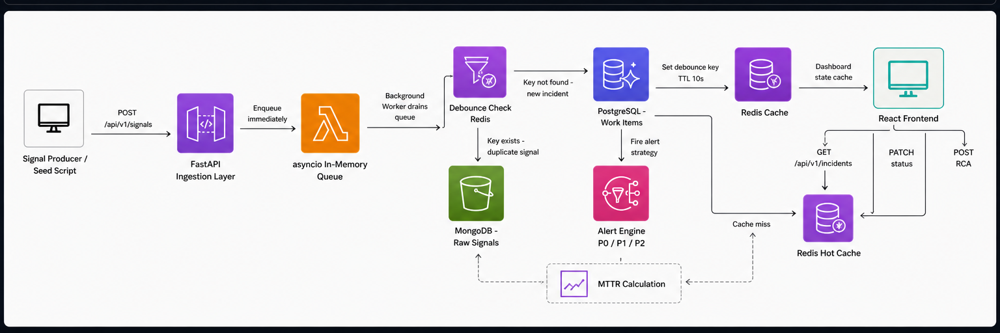

# Incident Management System (IMS)

**GitHub Repository:** https://github.com/DU-0408/ims-project

> A mission-critical, production-grade Incident Management System built for monitoring distributed infrastructure stacks. Designed to handle high-throughput signal ingestion, intelligent debouncing, workflow-driven incident lifecycle management, and mandatory Root Cause Analysis.

---

## Architecture Diagram

<picture>
  <source media="(prefers-color-scheme: dark)" srcset="docs/diagram-dark.png">
  
</picture>

---

## Tech Stack

| Layer | Technology | Purpose |
|---|---|---|
| Backend | Python + FastAPI | Async REST API |
| Task Queue | asyncio.Queue | In-memory backpressure buffer |
| RDBMS | PostgreSQL | Work Items, RCA records (source of truth) |
| NoSQL | MongoDB | Raw signal audit log |
| Cache | Redis | Debounce keys + dashboard hot-path |
| Frontend | React + Vite | Incident dashboard UI |
| Reverse Proxy | Nginx | Serve frontend + proxy API calls |
| Containerization | Docker Compose | Full stack orchestration |

---

## Setup Instructions

### Prerequisites
- Docker Desktop installed and running
- Git

### Running the Application

```bash
# Clone the repository
git clone https://github.com/DU-0408/ims-project.git
cd ims-project

# Start all services
docker compose up --build
```

### Access Points

| Service | URL |
|---|---|
| Frontend Dashboard | http://localhost:3000 |
| Backend Swagger UI | http://localhost:8000/docs |
| Health Check | http://localhost:8000/health |

### Simulating a Failure Event

```bash
cd scripts
pip install httpx
python seed_events.py
```

This script simulates:
1. **RDBMS Outage** — sends 150 signals for `POSTGRES_PRIMARY` → creates 1 P0 Work Item
2. **MCP Host Failure** — sends 50 signals for `MCP_HOST_01` → creates 1 P1 Work Item

---

## How Backpressure is Handled

The system uses a **two-layer approach** to handle bursts of up to 10,000 signals/sec without crashing:

**Layer 1 — asyncio In-Memory Queue**

When a signal hits `POST /api/v1/signals`, it is immediately pushed into an `asyncio.Queue` with a max size of 50,000. The API returns `200 Accepted` instantly without waiting for any database write. This means the ingestion endpoint never blocks, regardless of how slow the persistence layer is.

```python
signal_queue: asyncio.Queue = asyncio.Queue(maxsize=50000)

async def enqueue_signal(signal: dict):
    try:
        signal_queue.put_nowait(signal)
    except asyncio.QueueFull:
        print("[WARN] Signal queue full, dropping signal")
```

**Layer 2 — Background Worker**

A separate async task runs continuously, draining the queue and writing to MongoDB and PostgreSQL at their natural speed. This decouples ingestion speed from persistence speed entirely.

**Layer 3 — Rate Limiting**

The ingestion endpoint is protected by `slowapi` with a limit of 1000 requests/minute per IP, preventing cascading failures from a single bad actor.

---

## Design Patterns

### Strategy Pattern — Alerting

Different component failures trigger different alert strategies. The `AlertContext` class accepts any `AlertStrategy` implementation, making it trivially easy to swap alerting logic without changing calling code.

```python
class P0Alert(AlertStrategy):   # RDBMS, API failures
    def alert(self, work_item): ...  # Page on-call immediately

class P1Alert(AlertStrategy):   # MCP, Queue failures  
    def alert(self, work_item): ...  # Notify team channel

class P2Alert(AlertStrategy):   # Cache, NoSQL failures
    def alert(self, work_item): ...  # Log a ticket
```

### State Pattern — Incident Lifecycle

Work Item state transitions are managed by dedicated state classes, each responsible for defining what the next valid state is. The `ClosedState` enforces the mandatory RCA requirement.

```
OPEN → INVESTIGATING → RESOLVED → CLOSED
```

Attempting to close an incident without a complete RCA returns a `400 Bad Request` with a clear error message.

---

## API Endpoints

| Method | Endpoint | Purpose |
|---|---|---|
| POST | `/api/v1/signals` | Ingest a signal |
| GET | `/api/v1/incidents` | List all incidents (Redis cached) |
| GET | `/api/v1/incidents/{id}` | Get incident + raw signals |
| PATCH | `/api/v1/incidents/{id}/status` | Advance incident state |
| POST | `/api/v1/incidents/{id}/rca` | Submit RCA |
| GET | `/health` | Health check for all services |

---

## Non-Functional Features (Bonus)

### Security
- **Rate Limiting** — `slowapi` token bucket limiter on the ingestion endpoint (1000 req/min per IP) prevents abuse and cascading failures
- **CORS** — Restricted to known frontend origin only
- **Input Validation** — All API payloads validated via Pydantic models before processing

### Observability
- **Health Endpoint** — `GET /health` checks PostgreSQL, MongoDB, and Redis connectivity and returns per-service status
- **Throughput Metrics** — Backend prints `signals/sec` and queue size to console every 5 seconds
- **Structured Logging** — All worker events, alerts, and errors are prefixed and logged consistently

### Resilience
- **Debouncing** — 100 signals for the same component within 10 seconds create only 1 Work Item, preventing alert storms
- **Queue Overflow Protection** — Signals are dropped gracefully when queue is full instead of crashing the process
- **Async Throughout** — Every database operation is fully async, no blocking calls anywhere in the stack

### Data Separation
- **MongoDB** — Raw signal audit log (high volume, schema-flexible)
- **PostgreSQL** — Work Items and RCA records (structured, transactional)
- **Redis** — Debounce keys (TTL-based) + dashboard cache (hot-path reads)

---

## Project Structure

```
ims-project/
  /backend
    /app
      /api          # REST endpoints (signals, incidents, health)
      /core         # Config, database connections
      /ingestion    # Queue and background worker
      /models       # PostgreSQL models
      /workflow     # State machine and alerting strategies
    main.py
    requirements.txt
    Dockerfile
  /frontend
    /src
      /api          # Axios client
      /components   # StatusBadge, Toast, useToast
      /pages        # Dashboard, IncidentDetail, RCAForm
    nginx.conf
    Dockerfile
  /scripts
    seed_events.py  # Failure simulation script
  /docs
    prompts.md      # All AI prompts used during development
  docker-compose.yml
  README.md
```

---

## Prompts and AI Usage

All prompts and AI interactions used during the development of this project are documented in `/docs/prompts.md` as required by the assignment guidelines.

